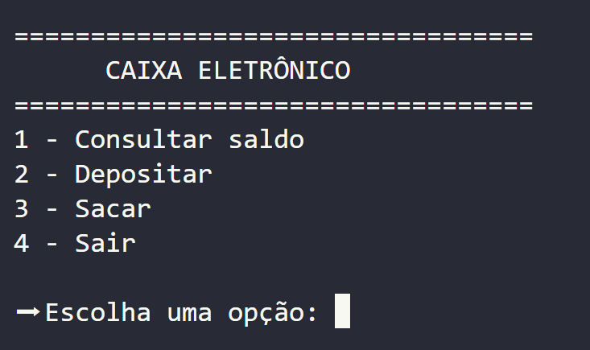

# 🏧 Sistema de Caixa Eletrônico em Python

Projeto desenvolvido para praticar os fundamentos da linguagem Python por meio da simulação de um caixa eletrônico executado via terminal.

| Status | Versão | Linguagem |
| :----: | :----: | :--------: |
| ✅ Concluído | 1.0 | Python 3 |

---

## 📖 Sobre o projeto

Este projeto simula o funcionamento básico de um caixa eletrônico utilizando Python e execução via terminal.

O principal objetivo foi consolidar conceitos fundamentais da linguagem, desenvolvendo uma aplicação organizada, funcional e de fácil compreensão. Durante o desenvolvimento, busquei aplicar boas práticas de programação desde os primeiros projetos, fortalecendo minha base para projetos cada vez mais complexos.

---

## ✨ Funcionalidades

- ✅ Consultar saldo
- ✅ Realizar depósitos
- ✅ Efetuar saques
- ✅ Encerrar o sistema

---

## 🛠 Tecnologias utilizadas

- Python 3

---

## 📚 Conceitos praticados

- Variáveis
- Estruturas condicionais (`if` / `elif` / `else`)
- Laços de repetição (`while`)
- Funções
- Entrada e saída de dados
- Lógica de programação
- Organização de código

---

## 📂 Estrutura do projeto

```text
python-caixa-eletronico/
│
├── main.py
├── README.md
├── LICENSE
└── .gitignore
```

---

## ▶️ Como executar

1. Clone este repositório:

```bash
git clone https://github.com/MatheusPhelipeDEV/python-caixa-eletronico.git
```

2. Acesse a pasta do projeto:

```bash
cd python-caixa-eletronico
```

3. Execute o programa:

```bash
python main.py
```

---

## 📸 Demonstração

Abaixo está uma captura da interface do sistema executado via terminal.

<p align="center">
  
</p>

---

## 🎯 Aprendizados

Durante o desenvolvimento deste projeto pude fortalecer minha lógica de programação e compreender melhor como estruturar aplicações executadas via terminal.

Além disso, pratiquei conceitos essenciais da linguagem Python, como funções, estruturas condicionais, laços de repetição e organização do código, criando uma base sólida para projetos futuros.

---

## 🚀 Próximas melhorias

- [ ] Persistência de dados em arquivo
- [ ] Histórico de transações
- [ ] Cadastro de múltiplos usuários
- [ ] Interface gráfica
- [ ] Testes automatizados

---

## 👨‍💻 Autor

**Matheus Phelipe**

🎓 Estudante de Análise e Desenvolvimento de Sistemas (UniOpet)

💼 Desenvolvedor de Software em Formação

🔗 LinkedIn:  
https://www.linkedin.com/in/matheus-phelipe-dev/

🐙 GitHub:  
https://github.com/MatheusPhelipeDEV
